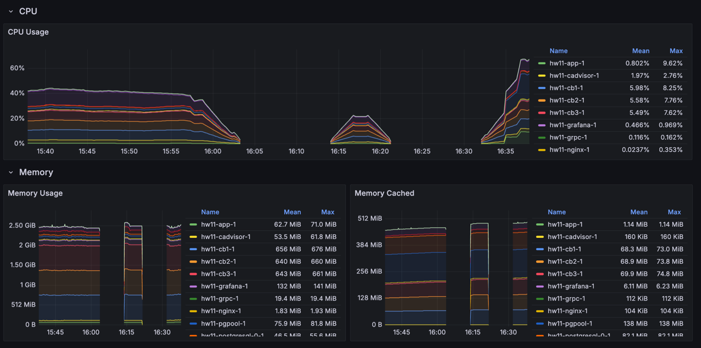
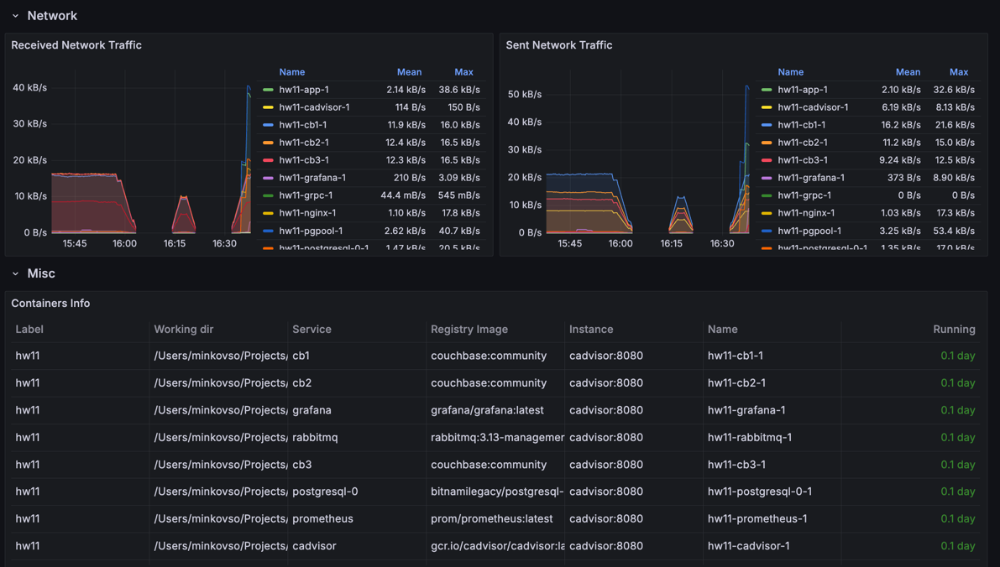
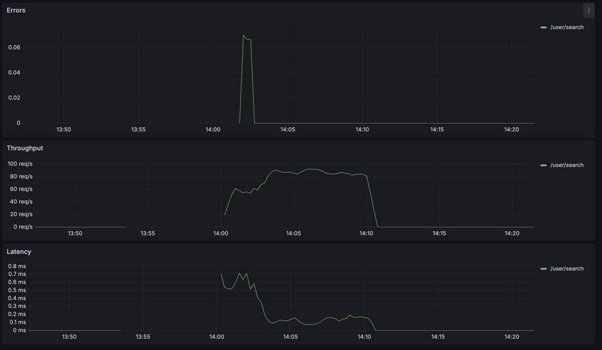

## Мониторинг
Для хранения и сбора метрик выбран **Prometheus**.  
Для визуализации метрик и построения дашбордов выбран **Grafana**, доступный по порту **3000**.  
Приложение по-прежнему доступно через **Nginx** по порту **80**.

Запуск приложения
```sh
docker compose up --scale app=3
```

Генерация и вставка данных в postgresql и couchbase
```sh
./db/generate_data.sh
```

Генерация данных для нагрузочного тестирование
```sh
./tests/generate_data.sh
```

Запуск нагрузочного тестирования
```sh
./tests/test.sh
```

Остановка приложения
```sh
docker compose down
```

### Сбор технических метрик
Сбор технических метрик осуществляется при помощи **cadvisor**. Он позволяет собирать различные показания контейнеров, 
работающих внутри докера. Для визуализации был выбран готовый дашборд **14282**.  




### Сбор бизнес метрик
Сбор бизнес метрик осуществляется при помощи **prometheus-fastapi-instrumentator**, который возвращает различные 
показания конкретного экземпляра приложения при обращении на **/metrics**. Создается отдельный дашборд, в котором 
настраиваются 3 панели:  
**Latency**  
`sum by(handler) (increase(http_request_duration_seconds_sum[$__rate_interval])) / 
sum by(handler) (clamp_min(increase(http_request_duration_seconds_count[$__rate_interval]), 1))`  
**Throughput**  
`sum by(handler) (rate(http_requests_total{status!="5xx"}[$__rate_interval]))`  
**Errors**  
`sum by(handler) (rate(http_requests_total{status="5xx"}[$__rate_interval]))`  

