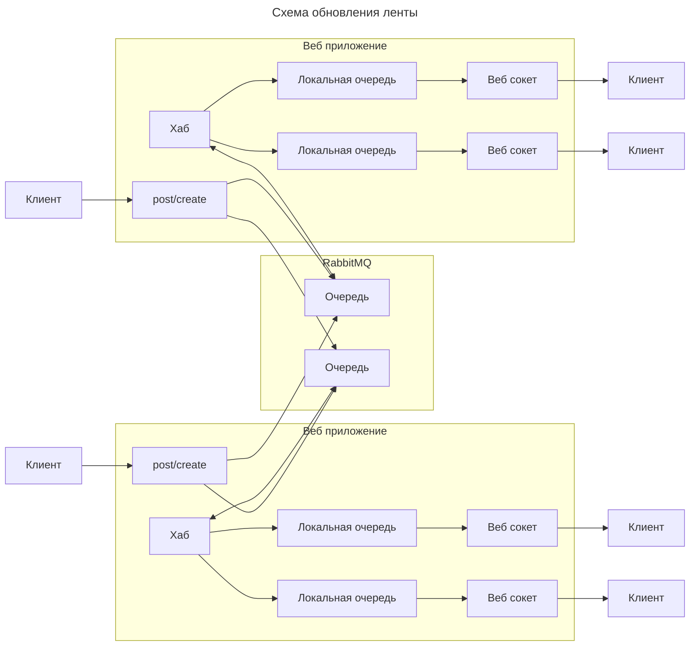

## Онлайн обновление ленты новостей

В качестве брокера сообщений выбран **RabbitMQ**.  
Каждый экземпляр веб-приложения читает из своей очереди, куда попадают сообщения механизмом **routing_key**.  
Веб-сокет доступен по адресу **/post/feed/posted**.

Запуск приложения
```sh
docker compose up
```

Генерация и вставка данных в postgresql
```sh
./db/generate_data.sh
```

Генерация и вставка данных в redis 
```sh
./cache/generate_data.sh
```

Остановка приложения
```sh
docker compose down
```

#### Масштабирование RabbitMQ
Есть возможность объединить несколько экземпляров RabbitMQ в один логический брокер через Erlang Cookie. 
Такой кластер имеет общие метаданные и очереди создаются только на одном узле. 
Клиент может подключаться к любому узлу и работать с очередями. 
Для распределения запросов необходимо использовать отдельный балансировщик.

#### Масштабирование сервиса веб-сокетов
Сервисом веб-сокетов является само веб-приложение, поэтому нужно запускать дополнительные экземпляры веб-приложения. 
Для кластера веб-серверов так же необходим балансировщик запросов.