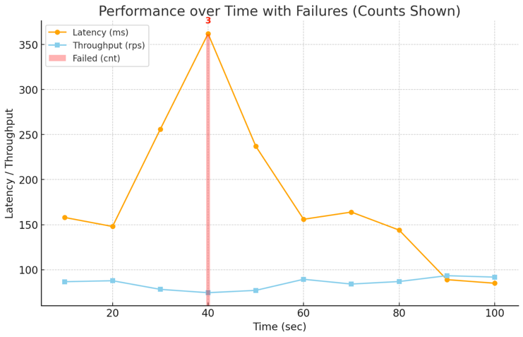
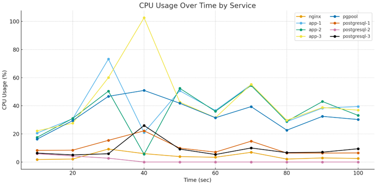
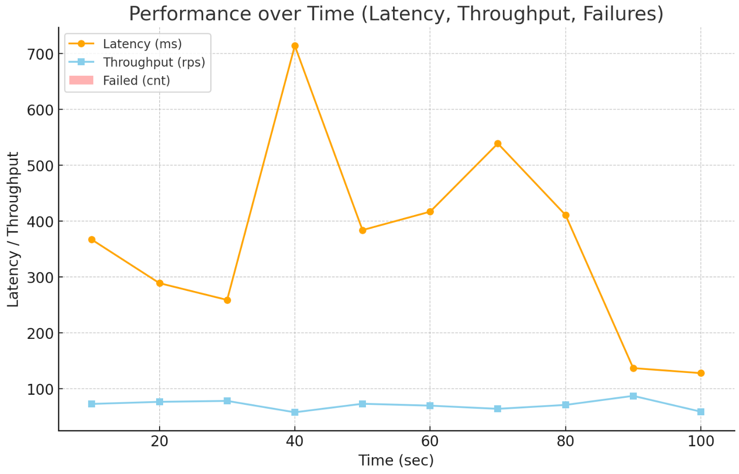
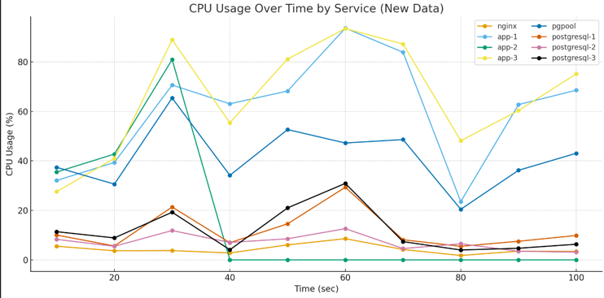

## Отказоустойчивость приложений
В качестве балансировщика для postgresql выбран **pgpool**.  
В качестве балансировщика для веб-приложения выбран **nginx**.  
Нагрузка осуществляется утилитой **k6** запросами на **/user/search**.

### Отказоустойчивость postgresql
В процессе нагрузочного тестирование останавливается сервис **postgresql-2** через графический интерфейс docker desktop. 
Снимаются задержка, пропускная способность, потери и нагрузка по CPU.

Запуск приложения
```sh
docker compose up --scale app=3
```

Генерация и вставка данных в postgresql и couchbase
```sh
./db/generate_data.sh
```

Генерация данных для нагрузочного тестирование
```sh
./tests/generate_data.sh
```

Запуск нагрузочного тестирования
```sh
./tests/db/test.sh
```

Остановка приложения
```sh
docker compose down
```




### Отказоустойчивость веб-приложения
В процессе нагрузочного тестирование останавливается сервис **app-2** через графический интерфейс docker desktop. 
Снимаются задержка, пропускная способность, потери и нагрузка по CPU.

Запуск приложения
```sh
docker compose up --scale app=3
```

Генерация и вставка данных в postgresql и couchbase
```sh
./db/generate_data.sh
```

Генерация данных для нагрузочного тестирование
```sh
./tests/generate_data.sh
```

Запуск нагрузочного тестирования
```sh
./tests/app/test.sh
```

Остановка приложения
```sh
docker compose down
```




### Результат тестирования
Оба эксперимента не привели к блокировке работы системы, в момент остановки сервисов наблюдается кратковременное
повышение задержки, понижения пропускной способности и небольшая потеря запросов.