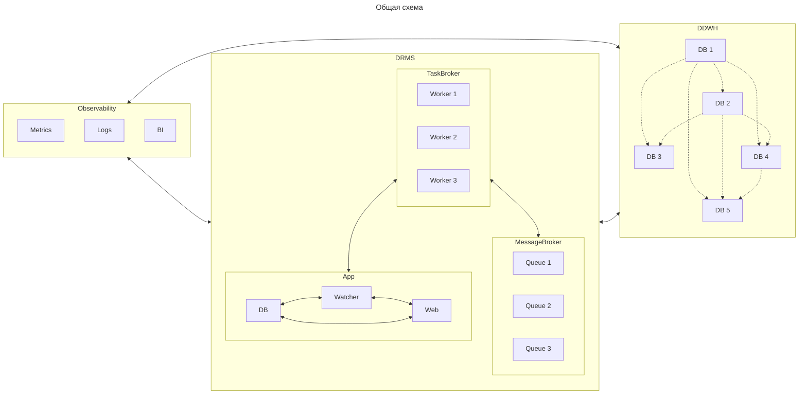

## Система управления распределенной репликацией данных
Система решает задачу управления распределённой репликацией данных в виде направленного ацикличного графа,
где множество источников и приёмников связаны логикой, а не ручными пайплайнами. Вместо жёстко закодированных
EL-процессов или цепочек задач, здесь данные описываются как граф состояний (узлы) и операций между ними (рёбра).
Каждый узел — это версия или срез данных (фильтрация и проекция), а система как целое — автоматический управляющий слой,
который знает, что и когда нужно пересчитать, где взять недостающие данные, и как восстанавливаться при сбое.

### Описание

#### App
Набор сервисов, которые предоставляют пользовательский интерфейс, систему управления репликацией данных и библиотеку 
коннекторов к различным системам данных.

* DB - база для хранения метаданных и состояния системы
* Watcher - система управления репликацией данных
* Web - пользовательский интерфейс

#### MessageBroker
Брокер сообщений, хранящий очереди задач репликации данных.

#### TaskBroker
Брокер задач, выполняющий задачи репликации данных.

#### DDWH
Распределенное хранилище данных, где каждый компонент является источником и приемником данных.

#### Observability
Набор систем для хранения логов, сбора и визуализации метрик.

### Функциональные требования
#### App
| **№** | **Функция**                 | **Описание**                                                                                              |
|-------|-----------------------------|-----------------------------------------------------------------------------------------------------------|
| 1     | Предоставление коннекторов  | Система должна предоставлять библиотеку коннекторов к различным системам данных.                          |
| 2     | Предоставление конструктора | Система должна предоставлять библиотеку универсального конструктора запросов к различным системам данных. |
| 3     | Предоставление экстракторов | Система должна предоставлять методы выгрузки данных из различных систем.                                  |
| 3     | Предоставление лоадеров     | Система должна предоставлять методы загрузки данных в различные системы.                                  |

* Web

  | **№** | **Функция**                        | **Описание**                                                                                        |
  |-------|------------------------------------|-----------------------------------------------------------------------------------------------------|
  | 1     | Предоставление списка данных       | Пользователь может запросить список и описание доступных ему данных для репликации.                 |
  | 2     | Предоставление структуры данных    | Пользователь может запросить структуру и ее описание выбранного набора данных.                      |
  | 3     | Добавление данных                  | Пользователь может публиковать новые данные в каталог.                                              |
  | 4     | Удаление данных                    | Пользователь может удалять данные из каталога.                                                      |
  | 5     | Добавление потребителя             | Пользователь может зарегистрировать потребителя данных.                                             |
  | 6     | Удаление потребителя               | Пользователь может удалить существующего потребителя данных.                                        |
  | 7     | Управление параметрами потребителя | Пользователь может задать правила проекции, фильтрации и прочее для конкретного потребителя данных. |
  | 8     | Согласование потребителя           | Пользователь может согласовать потребителя с заданными параметрами.                                 |
  | 9     | Предоставление списка потребителей | Пользователь может получить список всех зарегистрированных потребителей выбранного набора данных.   |
  | 10    | Логирование                        | Все операции системы должны логироваться.                                                           |
  | 11    | Аутентификация                     | Система должна обеспечивать вход пользователей с проверкой логина и пароля.                         |
  | 12    | Авторизация                        | Система должна ограничивать действия пользователя на основе ролей и прав.                           |
  | 13    | Мониторинг                         | Система должна предоставлять статистику текущего состояния.                                         |

* Watcher

  | **№** | **Функция**                | **Описание**                                                                                |
  |-------|----------------------------|---------------------------------------------------------------------------------------------|
  | 1     | Создание графа             | Система должна строить граф репликации на основе метаданных из базы данных.                 |
  | 2     | Добавление элемента в граф | Система должна корректно добавлять новый узел в граф репликации согласно заданным правилам. |
  | 3     | Удаление элемента из графа | Система должна корректно удалять узел из графа репликации согласно заданным правилам.       |
  | 4     | Валидация графа            | Система должна проверять граф репликации на соответствие метаданным.                        |
  | 5     | Постановка задач           | Система должна формировать и ставить задачи в соответствии с графом репликации.             |
  | 6     | Отслеживание задач         | Система должна отслеживать выполнение и статус задач репликации.                            |
  | 7     | Валидация задач            | Система должна проверять корректность результата задач репликации.                          |
  | 8     | Обработка ошибок           | Система должна фиксировать ошибки выполнения задач репликации и инициировать новые.         |
  | 9     | Мониторинг                 | Система должна предоставлять статистику текущего состояния.                                 |
  | 10    | Логирование                | Все операции системы должны логироваться.                                                   |

* DB

  | **№** | **Функция**               | **Описание**                                                                                         |
  |-------|---------------------------|------------------------------------------------------------------------------------------------------|
  | 1     | Хранение метаданных       | Система должна хранить метаданные о данных, источниках, структуре, потребителях и связях между ними. |
  | 2     | Обновление метаданных     | Система должна позволять обновлять метаданные.                                                       |
  | 3     | Предоставление метаданных | Система должна позволять получать метаданные.                                                        |
  | 4     | Обработка метаданных      | Система должна позволять обрабатывать метаданные.                                                    |
  | 5     | Логирование               | Все операции системы должны логироваться.                                                            |
  | 6     | Мониторинг                | Система должна предоставлять статистику текущего состояния.                                          |

#### MessageBroker
| **№** | **Функция**         | **Описание**                                                                    |
|-------|---------------------|---------------------------------------------------------------------------------|
| 1     | Создание очередей   | Брокер должен позволять создавать новые очереди для разных типов задач.         |
| 2     | Удаление очередей   | Брокер должен позволять удалять существующие очереди.                           |
| 3     | Добавление задач    | Брокер должен позволять помещать задачи в нужные очереди по заданным правилам.  |
| 4     | Распределение задач | Брокер должен предоставлять задачи исполнителям по заданным правилам.           |
| 5     | Подтверждение задач | После обработки задачи исполнитель может подтвердить выполнение.                |
| 6     | Обработка ошибок    | Если задача не подтверждена, брокер должен попытаться распределить её повторно. |
| 7     | Приоритеты задач    | Брокер должен поддерживать приоритизацию задач.                                 |
| 8     | Мониторинг          | Брокер должен предоставлять статистику текущего состояния системы.              |
| 9     | Логирование         | Все операции брокера должны логироваться.                                       |

#### TaskBroker
| **№** | **Функция**         | **Описание**                                                              |
|-------|---------------------|---------------------------------------------------------------------------|
| 1     | Получение задач     | Брокер должен получать задачи из назначенных очередей.                    |
| 2     | Выполнение задач    | Брокер должен обрабатывать полученные задачи согласно их типу.            |
| 3     | Подтверждение задач | После успешного выполнения задачи брокер должен отправлять подтверждение. |
| 4     | Обработка ошибок    | Брокер должен поддерживать механизм повторного выполнения задач.          |
| 5     | Мониторинг          | Брокер должен предоставлять статистику текущего состояния системы.        |
| 6     | Логирование         | Все операции брокера должны логироваться.                                 |

#### DDWH поставщик
| **№** | **Функция**                | **Описание**                                                                                 |
|-------|----------------------------|----------------------------------------------------------------------------------------------|
| 1     | Предоставление инкрементов | Система должна позволять получать новые или измененные данные согласно контракту.            |
| 2     | Предоставление данных      | Система должна позволять получать целевые данные согласно контракту.                         |
| 3     | Соответствие контракту     | Система должна соответствовать методам коннектора, конструктора, загрузки и выгрузки данных. |
| 4     | Мониторинг                 | Система должна предоставлять статистику текущего состояния.                                  |

#### DDWH потребитель
| **№** | **Функция**                | **Описание**                                                                                       |
|-------|----------------------------|----------------------------------------------------------------------------------------------------|
| 1     | Хранение инкрементов       | Система должна предоставлять область для временного хранения новых или измененных данных.          |
| 2     | Предоставление инкрементов | Система должна позволять получать данные из области временного хранения данных согласно контракту. |
| 3     | Хранение данных            | Система должна предоставлять область для постоянного хранения целевых данных.                      |
| 4     | Предоставление данных      | Система должна позволять получать данные из области постоянного хранения согласно контракту.       |
| 5     | Соответствие контракту     | Система должна соответствовать методам коннектора, конструктора, загрузки и выгрузки данных.       |
| 6     | Мониторинг                 | Система должна предоставлять статистику текущего состояния.                                        |