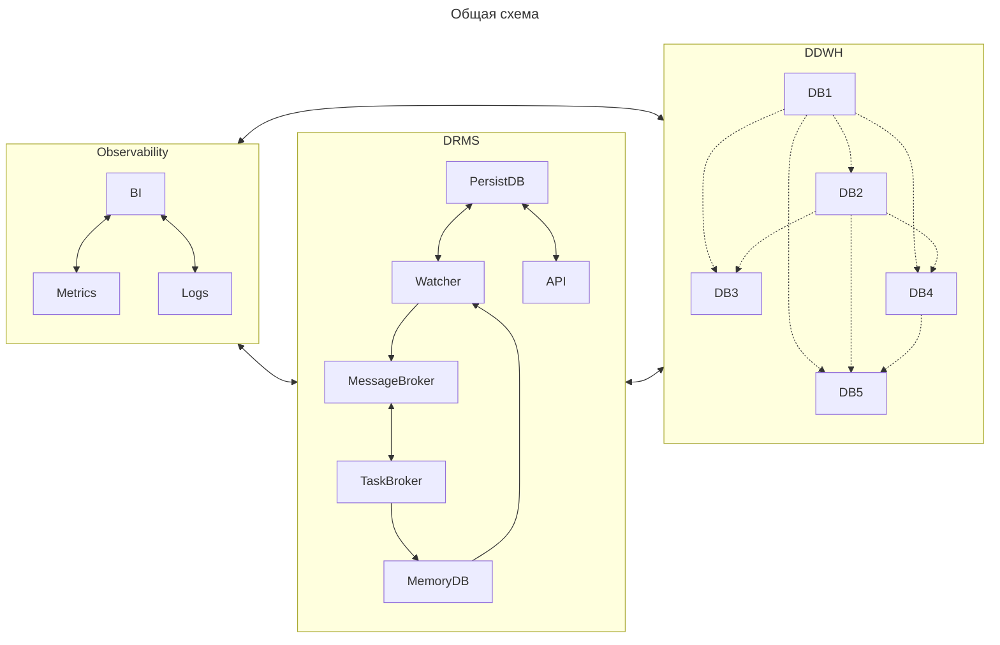
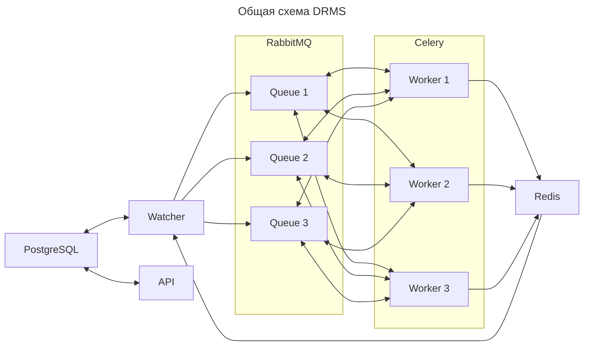

## Система управления распределенной репликации данных
Система решает задачу управления распределённой репликации данных в виде направленного ацикличного графа,
где множество источников и приёмников связаны логикой, а не ручными пайплайнами. Вместо жёстко закодированных
EL-процессов или цепочек задач, здесь данные описываются как граф состояний (узлы) и операций между ними (рёбра).
Каждый узел — это версия или срез данных (фильтрация и проекция), а система как целое — автоматический управляющий слой,
который знает, что и когда нужно пересчитать, где взять недостающие данные, и как восстанавливаться при сбое.

### Компоненты

#### DRMS
Система управления распределенной репликации данных - набор сервисов, которые совместно реализуют задачу 
репликации данных между источниками и приемниками.

* Watcher - координатор задач репликации данных.
* API - пользовательский интерфейс.
* PersistDB - постоянное хранилище метаданных, конфигураций, состояния задач репликации данных.
* MessageBroker - очередь задач репликации данных.
* TaskBroker - исполнитель задач репликации данных.
* MemoryDB - оперативное хранилище состояния задач репликации данных.

#### DDWH
Распределенное хранилище данных, где каждый компонент является источником и приемником данных.

#### Observability
Набор сервисов для хранения логов работы системы, сбора и визуализации метрик состояния системы.

### Функциональные требования
#### DRMS
| **№** | **Требование** | **Описание**                                                                                           |
|-------|----------------|--------------------------------------------------------------------------------------------------------|
| 1     | Коннекторы     | Система должна предоставлять библиотеку коннекторов к различным базам данных.                          |
| 2     | Конструктор    | Система должна предоставлять библиотеку универсального конструктора запросов к различным базам данных. |
| 3     | Экстракторы    | Система должна предоставлять методы выгрузки данных из различных баз.                                  |
| 4     | Лоадеры        | Система должна предоставлять методы загрузки данных в различные базы.                                  |
| 5     | Граф           | Система должна предоставлять библиотеку для работы с графом репликации.                                |

* API

  | **№** | **Требование**                     | **Описание**                                                                                      |
  |-------|------------------------------------|---------------------------------------------------------------------------------------------------|
  | 1     | Предоставление каталога            | Пользователь может запросить список и описание доступных ему данных для репликации.               |
  | 2     | Предоставление структуры           | Пользователь может запросить структуру выбранного набора данных.                                  |
  | 3     | Добавление в каталог               | Пользователь может публиковать новые данные в каталог.                                            |
  | 4     | Удаление из каталога               | Пользователь может удалять данные из каталога.                                                    |
  | 5     | Добавление потребителя             | Пользователь может зарегистрировать потребителя данных.                                           |
  | 6     | Удаление потребителя               | Пользователь может удалить существующего потребителя данных.                                      |
  | 7     | Управление параметрами потребителя | Пользователь может задать правила репликации для выбранного потребителя данных.                   |
  | 8     | Согласование потребителя           | Пользователь может согласовать потребителя данных с заданными правилами.                          |
  | 9     | Предоставление списка потребителей | Пользователь может получить список всех зарегистрированных потребителей выбранного набора данных. |
  | 10    | Аутентификация                     | Сервис должен обеспечивать вход пользователей с проверкой логина и пароля.                        |
  | 11    | Авторизация                        | Сервис должен ограничивать действия пользователя на основе ролей и прав.                          |

* Watcher

  | **№** | **Требование**             | **Описание**                                                                                       |
  |-------|----------------------------|----------------------------------------------------------------------------------------------------|
  | 1     | Постановка задач           | Сервис должен формировать и ставить задачи в соответствии с графом репликации.                     |
  | 2     | Отслеживание задач         | Сервис должен отслеживать выполнение и статус задач.                                               |
  | 3     | Валидация задач            | Сервис должен проверять корректность результата задач.                                             |
  | 4     | Обработка ошибок           | Сервис должен поддерживать механизм повторной постановки задач в соответствии с графом репликации. |

#### DDWH поставщик
| **№** | **Требование**             | **Описание**                                                                                 |
|-------|----------------------------|----------------------------------------------------------------------------------------------|
| 1     | Предоставление инкрементов | Система должна позволять получать новые или измененные данные согласно контракту.            |
| 2     | Предоставление данных      | Система должна позволять получать целевые данные согласно контракту.                         |
| 3     | Соответствие контракту     | Система должна соответствовать методам коннектора, конструктора, загрузки и выгрузки данных. |

#### DDWH потребитель
| **№** | **Требование**             | **Описание**                                                                                       |
|-------|----------------------------|----------------------------------------------------------------------------------------------------|
| 1     | Хранение инкрементов       | Система должна предоставлять область для временного хранения новых или измененных данных.          |
| 2     | Предоставление инкрементов | Система должна позволять получать данные из области временного хранения данных согласно контракту. |
| 3     | Хранение данных            | Система должна предоставлять область для постоянного хранения целевых данных.                      |
| 4     | Предоставление данных      | Система должна позволять получать данные из области постоянного хранения согласно контракту.       |
| 5     | Соответствие контракту     | Система должна соответствовать методам коннектора, конструктора, загрузки и выгрузки данных.       |

### Нагрузочные требования
#### DRMS
| **№** | **Требование** | **Описание**                                                                              |
|-------|----------------|-------------------------------------------------------------------------------------------|
| 1     | Поставка       | Система должна предоставлять манифест или Helm-чарт для развертывания в среде Kubernetes. |
| 2     | Логирование    | Все операции системы должны логироваться.                                                 |
| 3     | Мониторинг     | Система должна предоставлять метрики текущего состояния.                                  |

* API

  | **№** | **Требование**         | **Описание**                                                                                    |
  |-------|------------------------|-------------------------------------------------------------------------------------------------|
  | 1     | Задержка               | Среднее время ответа не должно превышать 1 секунду при 10 запросах одновременно.                |
  | 2     | Пропускная способность | Приложение должно обеспечивать не менее 10 запросов в секунду.                                  |
  | 3     | API                    | Интерфейс приложения должен соответствовать REST-принципам.                                     |
  | 4     | Отказоустойчивость     | Автоматический перезапуск приложения при обнаружении сбоя.                                      |
  | 4     | Логирование            | Все операции системы должны логироваться.                                                       |
  | 5     | Мониторинг             | Система должна предоставлять статистику текущего состояния.                                     |
  | 6     | Асинхронность          | Приложение должно обрабатывать запросы асинхронно без блокирования основного потока выполнения. |
  | 2     | Реализация             | Система должна быть написано на языке Python версии не ниже 3.10.                               |
  | 3     | Конфигурируемость      | Основные параметры должны задаваться через конфигурационные файлы или переменные окружения.     |

* Watcher

  | **№** | **Требование**     | **Описание**                                                                                           |
  |-------|--------------------|--------------------------------------------------------------------------------------------------------|
  | 1     | Отказоустойчивость | Автоматический перезапуск приложения при обнаружении сбоя.                                             |
  | 2     | Производительность | Приложение должно выполнять до 5000 задач репликации в час со средней длительностью задачи 180 секунд. |
  | 3     | Масштабируемость   | Приложение должно обрабатывать до 250 задач репликации одновременно.                                   |

#### DB
| **№** | **Требование**         | **Описание**                                                                                 |
|-------|------------------------|----------------------------------------------------------------------------------------------|
| 1     | ACID                   | База данных должна соответствовать принципу ACID.                                            |
| 2     | Отказоустойчивость     | База данных должна поддерживать репликацию и автоматический перезапуск при обнаружении сбоя. |
| 3     | Надежность             | Должен быть реализован механизм регулярного бэкапа данных с возможностью восстановления.     |
| 4     | Мониторинг             | База данных должна предоставлять статистику текущего состояния.                              |
| 5     | Логирование            | Все операции базы данных должны логироваться.                                                |
| 6     | Пропускная способность | База данных должна принимать не менее 1000 запросов в секунду.                               |
| 7     | Параллелизм            | База данных должна поддерживать не менее 500 одновременных соединений.                       |

#### MessageBroker
| **№** | **Требование**         | **Описание**                                                           |
|-------|------------------------|------------------------------------------------------------------------|
| 1     | Пропускная способность | Брокер должен принимать не менее 500 сообщений в секунду.              |
| 2     | Глубина очереди        | Брокер должен поддерживать очереди глубиной не менее 100000 сообщений. |
| 3     | Потребители            | Брокер должен поддерживать не менее 50 подписчиков на очередь.         |
| 5     | Отказоустойчивость     | Автоматический перезапуск брокера при обнаружении сбоя.                |
| 6     | Надежность             | Брокер должен обеспечивать гарантированную доставку сообщений.         |
| 7     | Мониторинг             | Брокер должен предоставлять статистику текущего состояния.             |
| 8     | Логирование            | Все операции брокера должны логироваться.                              |

#### TaskBroker
| **№** | **Требование**      | **Описание**                                                                                       |
|-------|---------------------|----------------------------------------------------------------------------------------------------|
| 1     | Производительность  | Брокер должен выполнять до 5000 задач репликации в час со средней длительностью задачи 180 секунд. |
| 2     | Масштабируемость    | Брокер должен обрабатывать до 250 задач репликации одновременно.                                   |
| 3     | Отказоустойчивость  | Автоматический перезапуск брокера при обнаружении сбоя.                                            |

### Реализация

