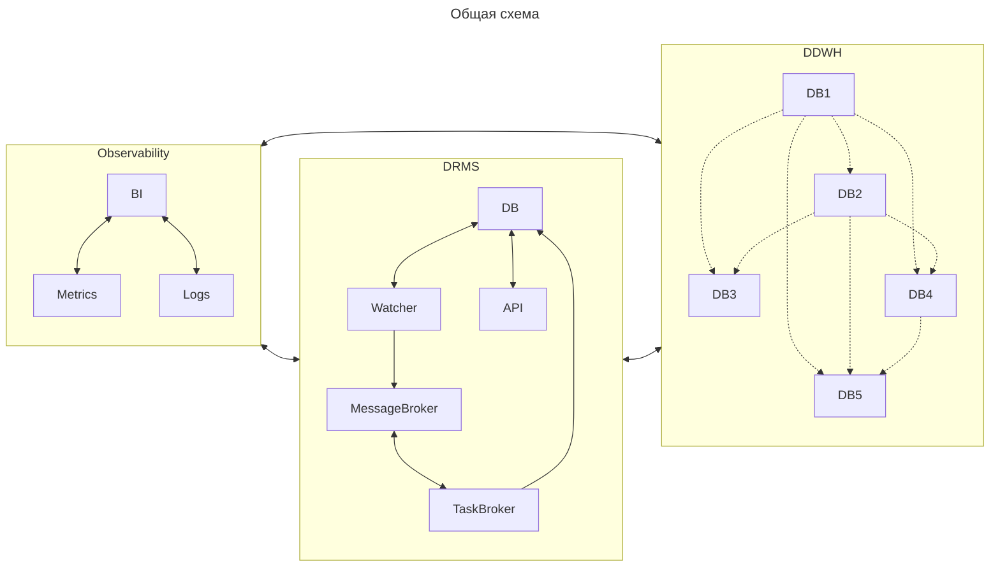
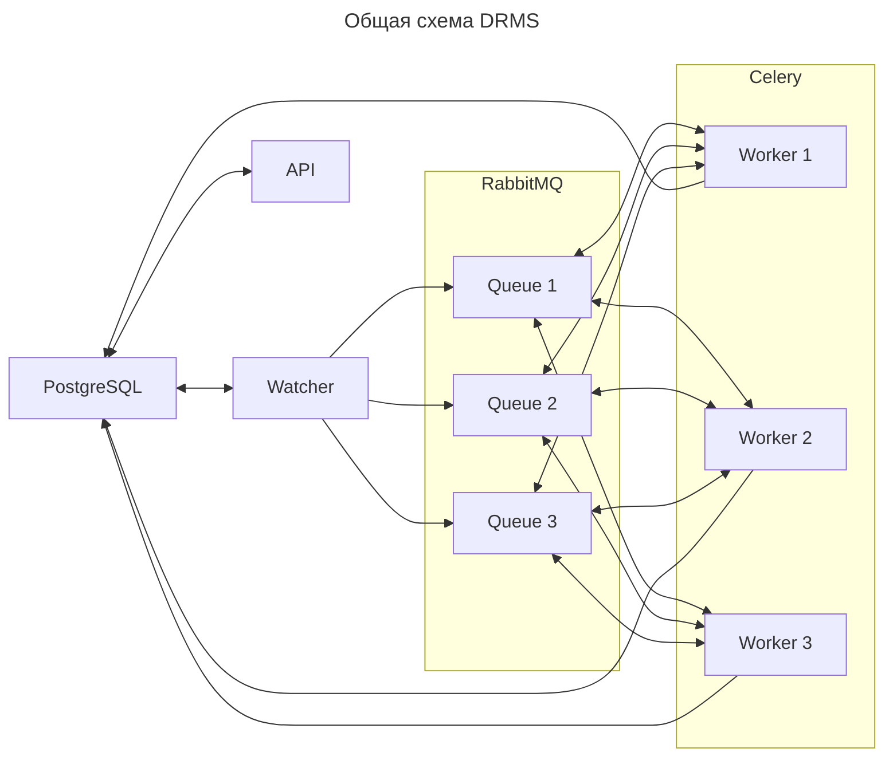
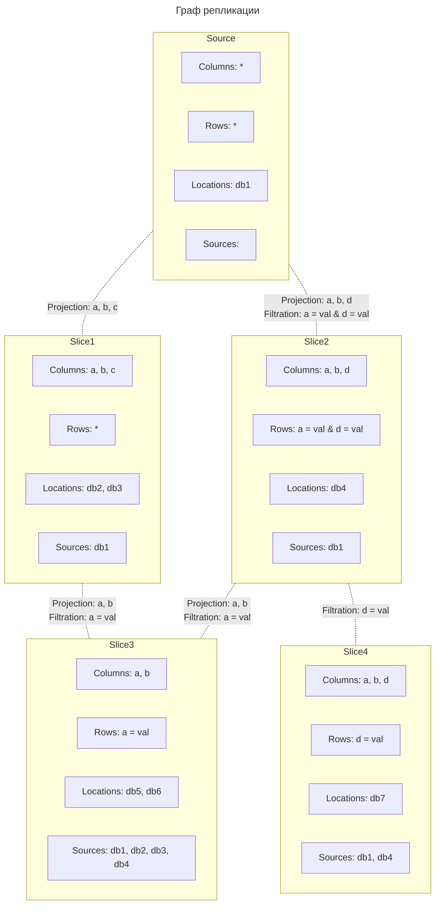

## Система управления распределенной репликации данных
Система решает задачу управления распределённой репликации данных в виде направленного ацикличного графа,
где множество источников и приёмников связаны логикой, а не ручными пайплайнами. Вместо жёстко закодированных
EL-процессов или цепочек задач, здесь данные описываются как граф состояний (узлы) и операций между ними (рёбра).
Каждый узел — это версия или срез данных (фильтрация и проекция), а система как целое — автоматический управляющий слой,
который знает, что и когда нужно пересчитать, где взять недостающие данные, и как восстанавливаться при сбое.

### Компоненты

#### DRMS
Система управления распределенной репликации данных - набор сервисов, которые совместно реализуют задачу 
репликации данных между источниками и приемниками.

* Watcher - координатор задач репликации данных.
* API - пользовательский интерфейс.
* DB - хранилище метаданных, конфигураций, состояния задач репликации данных.
* MessageBroker - очередь задач репликации данных.
* TaskBroker - исполнитель задач репликации данных.

#### DDWH
Распределенное хранилище данных, где каждый компонент является источником и приемником данных.

#### Observability
Набор сервисов для хранения логов работы системы, сбора и визуализации метрик состояния системы.

### Функциональные требования
#### DRMS
| **№** | **Требование** | **Описание**                                                                                           |
|-------|----------------|--------------------------------------------------------------------------------------------------------|
| 1     | Коннекторы     | Система должна предоставлять библиотеку коннекторов к различным базам данных.                          |
| 2     | Конструктор    | Система должна предоставлять библиотеку универсального конструктора запросов к различным базам данных. |
| 3     | Экстракторы    | Система должна предоставлять методы выгрузки данных из различных баз.                                  |
| 4     | Лоадеры        | Система должна предоставлять методы загрузки данных в различные базы.                                  |
| 5     | Граф           | Система должна предоставлять библиотеку для работы с графом репликации.                                |

* API

  | **№** | **Требование**                     | **Описание**                                                                                      |
  |-------|------------------------------------|---------------------------------------------------------------------------------------------------|
  | 1     | Предоставление каталога            | Пользователь может запросить список и описание доступных ему данных для репликации.               |
  | 2     | Предоставление структуры           | Пользователь может запросить структуру выбранного набора данных.                                  |
  | 3     | Добавление в каталог               | Пользователь может публиковать новые данные в каталог.                                            |
  | 4     | Удаление из каталога               | Пользователь может удалять данные из каталога.                                                    |
  | 5     | Добавление потребителя             | Пользователь может зарегистрировать потребителя данных.                                           |
  | 6     | Удаление потребителя               | Пользователь может удалить существующего потребителя данных.                                      |
  | 7     | Управление параметрами потребителя | Пользователь может задать правила репликации для выбранного потребителя данных.                   |
  | 8     | Согласование потребителя           | Пользователь может согласовать потребителя данных с заданными правилами.                          |
  | 9     | Предоставление списка потребителей | Пользователь может получить список всех зарегистрированных потребителей выбранного набора данных. |
  | 10    | Аутентификация                     | Сервис должен обеспечивать вход пользователей с проверкой логина и пароля.                        |
  | 11    | Авторизация                        | Сервис должен ограничивать действия пользователя на основе ролей и прав.                          |

* Watcher

  | **№** | **Требование**             | **Описание**                                                                                       |
  |-------|----------------------------|----------------------------------------------------------------------------------------------------|
  | 1     | Постановка задач           | Сервис должен формировать и ставить задачи в соответствии с графом репликации.                     |
  | 2     | Отслеживание задач         | Сервис должен отслеживать выполнение и статус задач.                                               |
  | 3     | Валидация задач            | Сервис должен проверять корректность результата задач.                                             |
  | 4     | Обработка ошибок           | Сервис должен поддерживать механизм повторной постановки задач в соответствии с графом репликации. |

#### DDWH поставщик
| **№** | **Требование**             | **Описание**                                                                                 |
|-------|----------------------------|----------------------------------------------------------------------------------------------|
| 1     | Предоставление инкрементов | Система должна позволять получать новые или измененные данные согласно контракту.            |
| 2     | Предоставление данных      | Система должна позволять получать целевые данные согласно контракту.                         |
| 3     | Соответствие контракту     | Система должна соответствовать методам коннектора, конструктора, загрузки и выгрузки данных. |

#### DDWH потребитель
| **№** | **Требование**             | **Описание**                                                                                       |
|-------|----------------------------|----------------------------------------------------------------------------------------------------|
| 1     | Хранение инкрементов       | Система должна предоставлять область для временного хранения новых или измененных данных.          |
| 2     | Предоставление инкрементов | Система должна позволять получать данные из области временного хранения данных согласно контракту. |
| 3     | Хранение данных            | Система должна предоставлять область для постоянного хранения целевых данных.                      |
| 4     | Предоставление данных      | Система должна позволять получать данные из области постоянного хранения согласно контракту.       |
| 5     | Соответствие контракту     | Система должна соответствовать методам коннектора, конструктора, загрузки и выгрузки данных.       |

### Ожидаемая нагрузка
| **№** | **Показатель**                       | **Описание**                                                |
|-------|--------------------------------------|-------------------------------------------------------------|
| 1     | Частота репликации                   | Данные реплицируются не чаще одного раза в час.             |
| 2     | Количество репликаций                | Выполняется до 1000 задач репликации в час.                 |
| 3     | Средняя длительность репликации      | Задача репликации длится в среднем не более 1 минуты.       |
| 4     | Максимальная длительность репликации | Задача репликации длится не более 10 минут.                 |
| 5     | Средний объем репликации             | Задача репликации обрабатывает в среднем до 100 МБ данных.  |
| 6     | Максимальный объем репликации        | Задача репликации обрабатывает до 1 ГБ данных.              |

### Технические требования
#### DRMS
| **№** | **Требование** | **Описание**                                                                              |
|-------|----------------|-------------------------------------------------------------------------------------------|
| 1     | Поставка       | Система должна предоставлять манифест или Helm-чарт для развертывания в среде Kubernetes. |
| 2     | Логирование    | Все операции системы должны логироваться.                                                 |
| 3     | Мониторинг     | Система должна предоставлять метрики текущего состояния.                                  |

* API

  | **№** | **Требование**         | **Описание**                                                                                |
  |-------|------------------------|---------------------------------------------------------------------------------------------|
  | 1     | Интерфейс              | Интерфейс сервиса должен соответствовать REST-принципам.                                    |
  | 2     | Отказоустойчивость     | Автоматический перезапуск сервиса при обнаружении сбоя.                                     |
  | 3     | Асинхронность          | Сервис должен обрабатывать запросы асинхронно без блокирования основного потока выполнения. |
  | 4     | Реализация             | Сервис должен быть написано на языке Python версии не ниже 3.10.                            |
  | 5     | Параметризация         | Основные параметры должны задаваться через конфигурационные файлы или переменные окружения. |
  | 6     | Пул соединений         | Сервис должен использовать до 10 соединений к базе данных одновременно.                     |

* Watcher

  | **№** | **Требование**     | **Описание**                                                                                |
  |-------|--------------------|---------------------------------------------------------------------------------------------|
  | 1     | Отказоустойчивость | Автоматический перезапуск сервиса при обнаружении сбоя.                                     |
  | 2     | Масштабируемость   | Сервис должен обрабатывать до 50 задач одновременно.                                        |
  | 3     | Асинхронность      | Сервис должен обрабатывать задачи асинхронно без блокирования основного потока выполнения.  |
  | 4     | Реализация         | Сервис должен быть написано на языке Python версии не ниже 3.10.                            |
  | 5     | Параметризация     | Основные параметры должны задаваться через конфигурационные файлы или переменные окружения. |
  | 6     | Пул соединений     | Сервис должен использовать до 10 соединений к базе данных одновременно.                     |

* DB

  | **№** | **Требование**         | **Описание**                                                                                             |
  |-------|------------------------|----------------------------------------------------------------------------------------------------------|
  | 1     | ACID                   | Сервис должен соответствовать принципам ACID.                                                            |
  | 2     | Отказоустойчивость     | Сервис должен поддерживать репликацию и автоматический перезапуск при обнаружении сбоя.                  |
  | 3     | Надежность             | Должен быть реализован механизм регулярного резервного копирования данных с возможностью восстановления. |
  | 4     | Пропускная способность | Сервис должен обрабатывать не менее 100 запросов в секунду.                                              |
  | 5     | Пул соединений         | Сервис должен обрабатывать не менее 100 соединений одновременно.                                         |

* MessageBroker

  | **№** | **Требование**         | **Описание**                                                           |
  |-------|------------------------|------------------------------------------------------------------------|
  | 1     | Пропускная способность | Сервис должен принимать не менее 100 сообщений в секунду.              |
  | 2     | Глубина очереди        | Сервис должен поддерживать очереди глубиной не менее 100000 сообщений. |
  | 3     | Пул соединений         | Сервис должен поддерживать не менее 50 подписчиков на очередь.         |
  | 4     | Отказоустойчивость     | Автоматический перезапуск сервиса при обнаружении сбоя.                |

* TaskBroker

  | **№** | **Требование**     | **Описание**                                            |
  |-------|--------------------|---------------------------------------------------------|
  | 1     | Масштабируемость   | Сервис должен обрабатывать до 50 задач одновременно.    |
  | 2     | Отказоустойчивость | Автоматический перезапуск брокера при обнаружении сбоя. |

### Реализация

### Развитие
* Bootstrap - реализовать механизм эффективной репликации начального решения.
* Observability - определить бизнес метрики состояния системы.